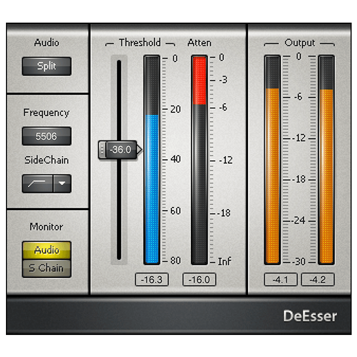

# G3X DeEsser

G3X DeEsser é um plugin de redução de sibilância em fase de planejamento. A
primeira entrega será um VST3 64-bit para Windows, desenvolvido em C++20 com
JUCE e CMake, seguindo o processo de produto e validação do DarkVox.

## Estado

**M0 — definição do produto aguardando confirmação.**

- [PRD](PRD.md)
- [Referência visual e fontes](docs/references/README.md)
- [Captura da interface de referência](docs/references/waves-deesser-interface.png)

## Limites da referência

O Waves DeEsser foi estudado somente para entender fluxo de trabalho,
hierarquia de controles e terminologia comum. O G3X DeEsser deverá possuir DSP,
marca, código, interface, textos, componentes gráficos e presets originais.

Nenhum ativo da Waves será incorporado ao produto final.

